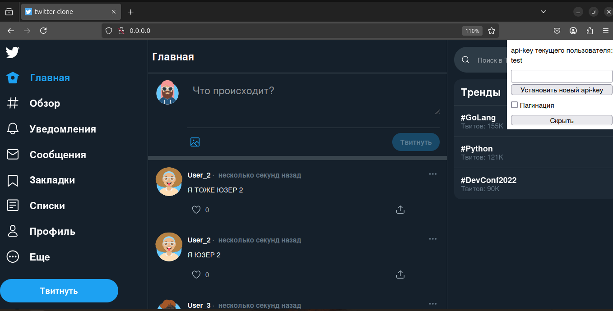

# Twitter-like Application

## Описание

Это Twitter-подобное приложение, в котором пользователи могут взаимодействовать с твитами различными способами.

### Функциональность для пользователя:

1. Пользователь может добавить новый твит.
2. Пользователь может удалить свой твит.
3. Пользователь может подписаться на другого пользователя.
4. Пользователь может отписаться от другого пользователя.
5. Пользователь может отмечать твит как понравившийся.
6. Пользователь может убрать отметку «Нравится».
7. Пользователь может получить ленту из твитов, отсортированных в порядке убывания по популярности от пользователей, которых он фоловит.
8. Твит может содержать картинку.

### Скриншот стартовой страницы


## Инструкция по запуску

### Предварительные требования

- Установите Docker и Docker Compose на ваш компьютер.

#### Установка Docker

1. **Обновите список пакетов и установите зависимости:**

    ```bash
    sudo apt update
    sudo apt install apt-transport-https ca-certificates curl software-properties-common
    ```

2. **Добавьте GPG ключ Docker и репозиторий Docker в ваш список источников:**

    ```bash
    curl -fsSL https://download.docker.com/linux/ubuntu/gpg | sudo gpg --dearmor -o /usr/share/keyrings/docker-archive-keyring.gpg
    echo "deb [arch=amd64 signed-by=/usr/share/keyrings/docker-archive-keyring.gpg] https://download.docker.com/linux/ubuntu $(lsb_release -cs) stable" | sudo tee /etc/apt/sources.list.d/docker.list > /dev/null
    ```

3. **Установите Docker:**

    ```bash
    sudo apt update
    sudo apt install docker-ce
    ```

4. **Убедитесь, что Docker запущен и добавьте вашего пользователя в группу Docker:**

    ```bash
    sudo systemctl status docker
    sudo usermod -aG docker ${USER}
    ```

5. **Перезапустите вашу сессию или выполните:**

    ```bash
    su - ${USER}
    ```

6. **Проверьте установку Docker:**

    ```bash
    docker --version
    ```

#### Установка Docker Compose

1. **Загрузите последнюю версию Docker Compose:**

    ```bash
    sudo curl -L "https://github.com/docker/compose/releases/download/1.29.2/docker-compose-$(uname -s)-$(uname -m)" -o /usr/local/bin/docker-compose
    ```

### Запуск приложения

Для запуска приложения выполните следующие шаги:

1. Клонируйте репозиторий:

    ```bash
    git clone https://github.com/DmitryPankin/tweet-clone-mini.git

    cd tweet-clone-mini
    ```

2. Запустите Docker Compose:

    ```bash
    docker-compose up -d
    ```

Это поднимет все необходимые контейнеры для работы приложения.

### Остановка приложения

Для остановки и удаления контейнеров выполните:

```bash
docker-compose down
